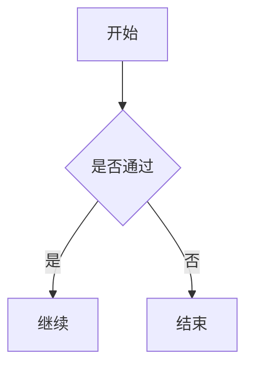

# Bruce Doc Converter Skill

> 为 Claude Code / OpenClaw 添加双向文档转换能力

[](https://github.com/anthropics/claude-code)
[](https://www.python.org/downloads/)
[](LICENSE)

**Bruce Doc Converter** 是一个 **Agent Skill**，为 **Claude Code / OpenClaw** 添加**双向文档转换**能力。安装后，AI 可以：

- **Office/PDF → Markdown**：将 Word、Excel、PowerPoint、PDF 等文档转换为 AI 友好的 Markdown 格式进行分析
- **Markdown → Word**：将 Markdown 导出为**排版精美的 Word 文档**，自动应用专业样式和格式
- **Mermaid 图片导出**：在 Markdown → Word 时，自动将 Mermaid 代码块渲染为图片并嵌入 Word

## 为什么需要这个 Skill？

Claude Code / OpenClaw 默认只能直接读取 Markdown 和纯文本文件。当你上传 Word、Excel、PDF 等文档时，AI 无法直接理解其内容。

这个 Skill 解决了这个问题：

- 让 AI 能够"阅读" Office 文档和 PDF
- 将文档转换为 AI 易于分析的 Markdown 格式
- 支持双向转换（Markdown 转 Word）

## 功能特性

### 文档转换能力

| 转换方向                         | 支持格式                  | 特性                                     |
| -------------------------------- | ------------------------- | ---------------------------------------- |
| **Office/PDF → Markdown** | .docx, .xlsx, .pptx, .pdf | 标题、列表、表格、格式                   |
| **Markdown → Word**       | .md                       | 专业文档、样式保留、Mermaid 代码块转图片 |

### 智能内容提取

- **标题识别**：自动识别 Word 标题层级（Heading 1-6）及中文标题样式
- **格式保留**：保留粗体、斜体等文本格式
- **表格转换**：智能转换表格为 Markdown 格式
- **列表支持**：支持有序列表、无序列表及多级嵌套
- **Mermaid 图表**：支持基于 `mmdc (mermaid-cli)` 渲染 Mermaid 代码块，并以 Word 兼容性更好的 PNG 图片格式嵌入

### 轻量高效，节省 Tokens

与官方 docx 等通用 skill 相比，Bruce Doc Converter 预置了完整的转换脚本：

- **一次调用，直接出结果**：AI 无需现场推理如何处理文档、现场编写转换代码，直接调用预置脚本即可完成转换
- **节省 Tokens**：省去了多轮"写代码 → 执行 → 报错 → 修复"的来回，单次调用返回结构化结果
- **行为确定，结果稳定**：转换逻辑固定在脚本中，不依赖 AI 每次临时生成的代码，输出格式一致可预期
- 核心 Python 依赖仅 10-15MB（启用 Mermaid 高保真渲染会额外安装 Node 浏览器依赖）
- **自动安装**：首次运行时自动安装依赖到用户目录

## 安装

**最简方式：直接告诉你的 AI 来安装。**

把以下内容发给 Claude Code 或 OpenClaw：

```
帮我安装这个 skill：https://github.com/brucevanfdm/bruce-doc-converter
```

AI 会自动完成 clone 和配置，首次使用时依赖也会自动安装，无需任何手动操作。

### 环境要求

- **Python 3.6+**（必需）
- **Node.js 14+**（可选，仅 Markdown → Word 需要）

### 手动安装（可选）

如果你更喜欢自己动手：

```bash
# macOS/Linux
git clone https://github.com/brucevanfdm/bruce-doc-converter.git ~/.claude/skills/bruce-doc-converter

# Windows
git clone https://github.com/brucevanfdm/bruce-doc-converter.git %USERPROFILE%\.claude\skills\bruce-doc-converter
```

依赖会在首次使用时自动安装，无需手动操作。如果自动安装失败，可以手动执行：

```bash
pip install --user python-docx openpyxl python-pptx pdfplumber
```

## 使用方式

### 跨平台执行说明

根据你的操作系统和环境，选择合适的执行方式：

| 环境                         | 推荐命令                                                                         | 说明                          |
| ---------------------------- | -------------------------------------------------------------------------------- | ----------------------------- |
| **Linux/macOS**        | `./convert.sh <file>`                                                          | 直接执行 Shell 脚本           |
| **Windows PowerShell** | `.\convert.ps1 <file>`                                                         | 推荐方式，支持 UTF-8 编码     |
| **Windows Git Bash**   | `powershell.exe -Command "Set-Location '<skill-dir>'; .\convert.ps1 '<file>'"` | 在 Git Bash 中调用 PowerShell |
| **Windows CMD**        | `convert.bat <file>`                                                           | 传统方式，可能有编码问题      |

**在 Claude Code / OpenClaw 中使用**：

Claude Code / OpenClaw 在 Windows 环境中通常运行在 Git Bash 中，因此推荐使用 PowerShell 方式：

```bash
powershell.exe -Command "Set-Location 'C:\Users\Bruce\.claude\skills\bruce-doc-converter'; .\convert.ps1 'c:\path\to\file.docx'"
```

### 对话示例

安装 Skill 后，在 Claude Code / OpenClaw 中直接对话即可：

#### 分析文档

```
帮我分析这个 report.docx 的内容
```

```
读取这个 data.xlsx 并总结数据
```

### 格式转换

```
把这个 document.pdf 转成 markdown
```

```
把 notes.md 导出为 Word 文档
```

### Mermaid 图片导出示例（新）

在 Markdown 中写 Mermaid 代码块，导出 Word 时会自动渲染为图片：

````markdown

````

导出后的 `.docx` 中会插入对应图表图片；如果 Mermaid 渲染失败，会自动回退为原始代码块，避免转换中断。

### 批量处理

```
转换 docs 文件夹里的所有文件
```

## 工作原理

当你在 Claude Code / OpenClaw 中请求处理文档时：

1. **检测需求**：Claude 识别到需要处理 Office/PDF/Markdown 文件
2. **调用转换脚本**：运行 `./convert.sh` 或 `python scripts/convert_document.py`
3. **自动处理**：
   - 检测 Python 环境
   - 验证文件格式
   - 自动安装缺失的依赖（到用户目录，无需虚拟环境）
   - 执行转换
4. **返回结果**：返回 JSON 格式的转换结果，包含 Markdown 内容和输出路径
5. **后续处理**：Claude 分析转换后的内容，回答你的问题

### 输出位置

转换后的文件保存在原文件同级目录：

```
your-project/
├── report.docx              # 原文件
├── document.md              # 原文件
├── Markdown/                # Office/PDF → Markdown 输出
│   └── report.md
└── Word/                    # Markdown → Word 输出
    └── document.docx
```

## 支持的格式

| 格式               | 输入 | 输出 | 质量       |
| ------------------ | ---- | ---- | ---------- |
| Word (.docx)       | ✅   | ✅   | 优秀       |
| Excel (.xlsx)      | ✅   | ❌   | 优秀       |
| PowerPoint (.pptx) | ✅   | ❌   | 良好       |
| PDF (.pdf)         | ✅   | ❌   | 取决于类型 |
| Markdown (.md)     | ✅   | ✅   | 优秀       |

> **注意**：不支持旧版格式（.doc, .xls, .ppt），请先转换为新格式。

## 常见问题

### 依赖缺失怎么办？

Skill 会自动检测并安装依赖，如果自动安装失败，可手动安装：

```bash
pip install --user python-docx openpyxl python-pptx pdfplumber
```

### 文件过大怎么办？

当前限制为 100MB，建议分割文件或压缩内容。

### Markdown 转 Word 失败？

需要安装 Node.js 和依赖：

```bash
cd scripts/md_to_docx
npm install
```

### Mermaid 没有导出成图片？

请优先检查以下两点：

1. Node.js 与 npm 可用（`node -v`、`npm -v`）
2. Mermaid 依赖已安装（`cd scripts/md_to_docx && npm install`）

如果仍失败，转换不会中断，文档会回退保留 Mermaid 原始代码块。

## 最佳实践

1. **使用新版 Office 格式**（.docx, .xlsx, .pptx）
2. **PDF 优先使用文本型**，扫描型建议先 OCR
3. **文件大小建议 < 50MB**

## 项目结构

```
bruce-doc-converter-skill/
├── SKILL.md                 # Claude Code Skill 定义
├── convert.sh               # 便捷运行脚本 (macOS/Linux)
├── convert.bat              # 便捷运行脚本 (Windows CMD)
├── convert.ps1              # 便捷运行脚本 (Windows PowerShell，推荐)
├── requirements.txt         # Python 依赖（参考）
├── scripts/
│   ├── convert_document.py  # 转换脚本核心（支持自动安装依赖）
│   └── md_to_docx/         # Markdown → Word 模块
├── references/
│   └── supported-formats.md # 格式支持详情
└── tests/                   # 测试文件

依赖安装位置（自动）:
~/.local/lib/python*/site-packages/  # Linux/macOS
%APPDATA%\Python\Python*\site-packages\  # Windows
```

## 技术细节

### 依赖管理

| 依赖        | 大小 | 用途            |
| ----------- | ---- | --------------- |
| python-docx | ~2MB | Word 处理       |
| openpyxl    | ~3MB | Excel 处理      |
| python-pptx | ~2MB | PowerPoint 处理 |
| pdfplumber  | ~5MB | PDF 处理        |

## 许可证

MIT License
